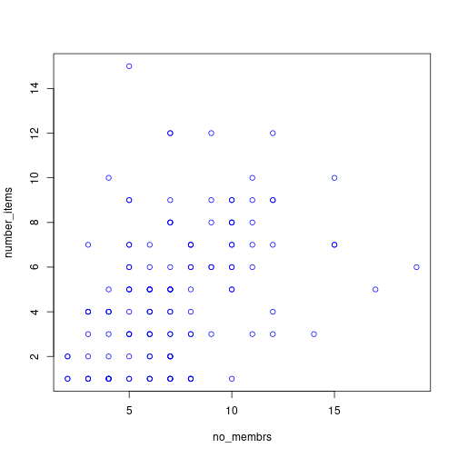
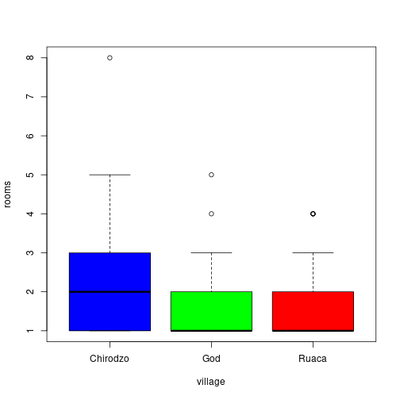
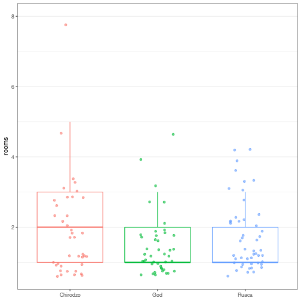

```{r setup, include=FALSE}
library(ggplot2)
library(dplyr)
library(tidyr)
library(here)
options(htmltools.dir.version = FALSE)
knitr::opts_chunk$set(
  #fig.width=9, fig.height=3.5, fig.retina=3,
  out.width = "100%",
  cache = FALSE,
  echo = TRUE,
  message = FALSE, 
  warning = FALSE,
  hiline = TRUE
)
interviews_plotting <- readr::read_csv(here("assets/data/interviews_plotting.csv"))
percent_items <- interviews_plotting %>% 
    group_by(village) %>%
    summarize(across(bicycle:no_listed_items, ~ sum(.x) / n() * 100)) %>% 
    pivot_longer(bicycle:no_listed_items, names_to = "items", values_to = "percent")
```

```{r xaringan-themer, include=FALSE, warning=FALSE}
library(xaringanthemer)
style_duo(
  primary_color = "#481567ff",
  secondary_color = "#20a387ff",
  text_bold_color = "#33638DFF",
  code_inline_color = "#fde725ff",
  link_color = "#fde725ff",
  outfile = here("assets/css/xaringan-themer.css")
)
```

class: center, middle, inverse

## Data Visualisation

---
class: center, middle

## Why ggplot2?

...because these are 'base' plots

.pull-left[
```{r base-pl-1, echo=FALSE}
plot(number_items ~ no_membrs, 
     interviews_plotting, 
     col = "blue")
```
]

.pull-right[
```{r base-pl-2, echo=FALSE}
boxplot(rooms ~ village, 
        interviews_plotting, 
        col = c("blue", "green", "red"))
```
]

---
class: center, middle

## Why ggplot2?

...and these are ggplots `r emo::ji("sunglasses")`

.pull-left[
```{r ggplot-1, echo=FALSE}
interviews_plotting %>% 
   ggplot(aes(x = no_membrs, y = number_items, color = village)) +
      geom_count(alpha = 0.6) +
      theme_minimal() +
      labs(x = "Number of items", 
           y = "Number of members in a household")
```
]

.pull-right[
```{r ggplot-2, echo=FALSE}
interviews_plotting %>%
    ggplot(aes(x = village, y = rooms, col = village)) +
    geom_boxplot(outlier.colour = NA) +
    geom_jitter(width = 0.2, alpha = 0.6) +
    theme_bw() +
    theme(legend.position = "none",
          axis.title.x = element_blank(),
          panel.grid.minor.x = element_blank(),
          panel.grid.major.x = element_blank()) +
    scale_fill_viridis_d() # add colourblind-friendly palette
```
]

---
class: center, middle

.pull-left[



]

.pull-right[



]

---
class: center, middle

## ggplot2


[**ggplot2**](https://ggplot2.tidyverse.org/) is a package (included in **tidyverse**) for creating highly customisable plots that are built
step-by-step by adding layers.

The separation of a plot into layers allows a high degree of flexibility with
minimal effort.

---
class: center, middle

```r
<DATA> %>%
    ggplot(aes(<MAPPINGS>)) +
    <GEOM_FUNCTION>() +
    <CUSTOMISATION>
```
<a href="https://github.com/allisonhorst/stats-illustrations">

</a>

More artwork by [Allison Horst](https://github.com/allisonhorst/stats-illustrations)

---
class: center, middle, inverse

Before we start with the exercises

we want to make sure the plots we generate

are saved to the `fig_output` folder

--

Go to the `setup` chunk and insert

```{r eval=FALSE}
knitr::opts_chunk$set(
  fig.path = here("fig_output/")
)
```

---
class: center, middle, inverse

## Data Visualisation Exercises

---
class: center, middle

## Exercise 1

`r emo::ji("clock")` **10 mins**

Create a scatter plot of `rooms` by `village` with the `respondant_wall_type`
showing in different colours. 

Does this seem like a good way to display the relationship between these variables?

What other kinds of plots might you use to show this type of data?

`r countdown::countdown(minutes = 10, color_running_background  = "lightgreen", color_running_text = "black", color_finished_background = "red", color_finished_text =  "grey30")`

---
class: center, middle, inverse

## Exercise 1: Solution

```{r exercise-1-sol, fig.width=9, fig.height=3.5, fig.retina=3}
interviews_plotting %>%
    ggplot(aes(x = village, y = rooms)) +
    geom_jitter(aes(color = respondent_wall_type),
		    alpha = 0.5, width = 0.2, height = 0.2)
```

It's difficult to distinguish between villages and see patterns, right?

Suggestions to improve this?

---
class: center, middle

## Exercise 2

`r emo::ji("clock")` **5 mins**

Boxplots are useful summaries, but hide the shape of the distribution. For example,
if the distribution is bimodal, we wouldn't see it in a boxplot.

Replace the box plot with a violin plot  
see `geom_violin()`

`r countdown::countdown(minutes = 5, color_running_background  = "lightgreen", color_running_text = "black", color_finished_background = "red", color_finished_text =  "grey30")`

---
class: center, middle, inverse

## Exercise 2: Solution

```{r exercise-2-sol, fig.width=9, fig.height=3.5, fig.retina=3}
interviews_plotting %>%
  ggplot(aes(x = respondent_wall_type, y = rooms)) +
  geom_violin(alpha = 0) +
  geom_jitter(alpha = 0.5, width = 0.4, color = "tomato")
```

---
class: center, middle


---
class: center, middle

## Exercise 3

`r emo::ji("clock")` **10 mins**

Create a bar plot showing the proportion of respondents in each village who are 
or are not part of an irrigation association (`memb_assoc`). 

Include only respondents who answered that question in the calculations and plot.

Which village had the lowest proportion of respondents in an irrigation association?

`r countdown::countdown(minutes = 10, color_running_background  = "lightgreen", color_running_text = "black", color_finished_background = "red", color_finished_text =  "grey30")`

--

### Hint

```{r exercise-3-hint}
percent_memb_assoc <- interviews_plotting %>%
  filter(!is.na(memb_assoc)) %>%
  count(village, memb_assoc) %>%
  group_by(village) %>%
  mutate(percent = (n / sum(n)) * 100) %>%
  ungroup()
```

---
class: center, middle, inverse

## Exercise 3: Solution

```{r exercise-3-sol, fig.width=7, fig.height=2.5, fig.retina=3}
percent_memb_assoc <- interviews_plotting %>%
  filter(!is.na(memb_assoc)) %>%
  count(village, memb_assoc) %>%
  group_by(village) %>%
  mutate(percent = (n / sum(n)) * 100) %>%
  ungroup()

percent_memb_assoc %>%
   ggplot(aes(x = village, y = percent, fill = memb_assoc)) +
    geom_bar(stat = "identity", position = "dodge")
```

---
class: center, middle

## Exercise 4

`r emo::ji("clock")` **5 mins**

Experiment with at least two different themes. Build the previous plot using each
of those themes. 

Which do you like best?

`r countdown::countdown(minutes = 5, color_running_background  = "lightgreen", color_running_text = "black", color_finished_background = "red", color_finished_text =  "grey30")`

--

### Hint

.pull-left[
`theme_minimal`  
`theme_void`  
`theme_classic`  
]
.pull-right[
`theme_dark`  
`theme_grey`  
`theme_light`
]
---
class: center, middle, inverse

## Exercise 4: Solution

```{r exercise-4-sol, eval=FALSE}
percent_items %>%
    ggplot(aes(x = village, y = percent)) +
    geom_bar(stat = "identity", position = "dodge") +
    facet_wrap(~ items) +
    theme_bw() + #<<
    theme(panel.grid = element_blank())
```


---
class: center, middle, inverse

## Saving plots

Two options:

```{r eval=FALSE}
# for the console
ggsave(here("fig_output/my-pretty-plot.png"))
```

or

```yaml
# yaml header
  # name will be chunk label
knitr::opts_chunk$set(fig.path = here("fig_output/))
```

---
class: center, middle, inverse

## Possibilities

<https://r-graph-gallery.com/ggplot2-package.html>

